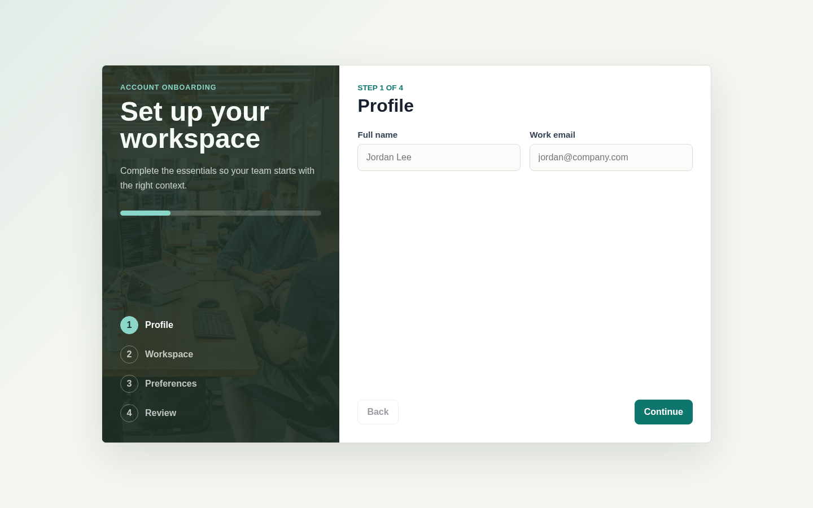
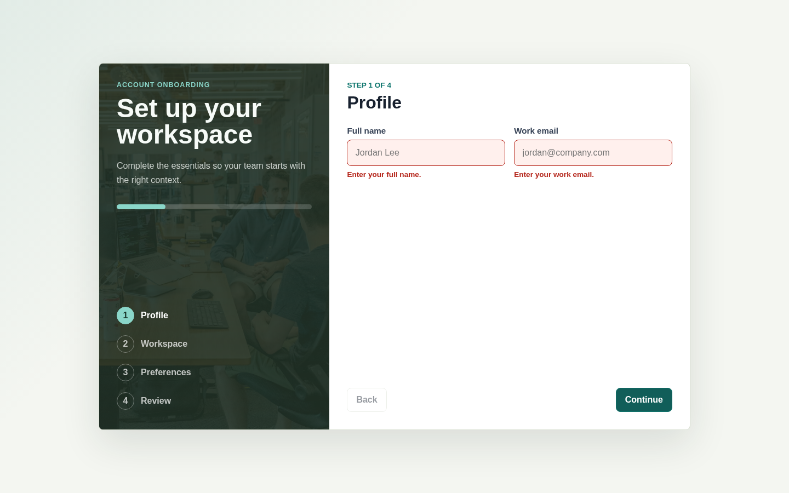
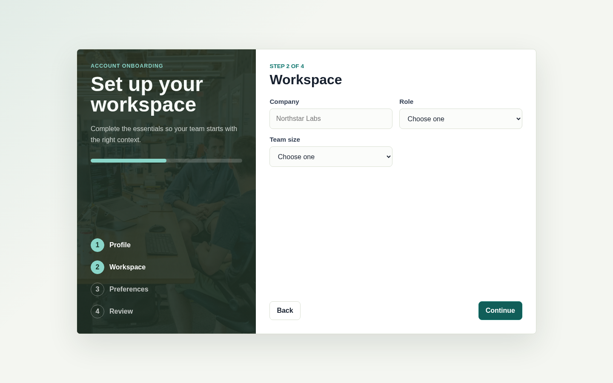
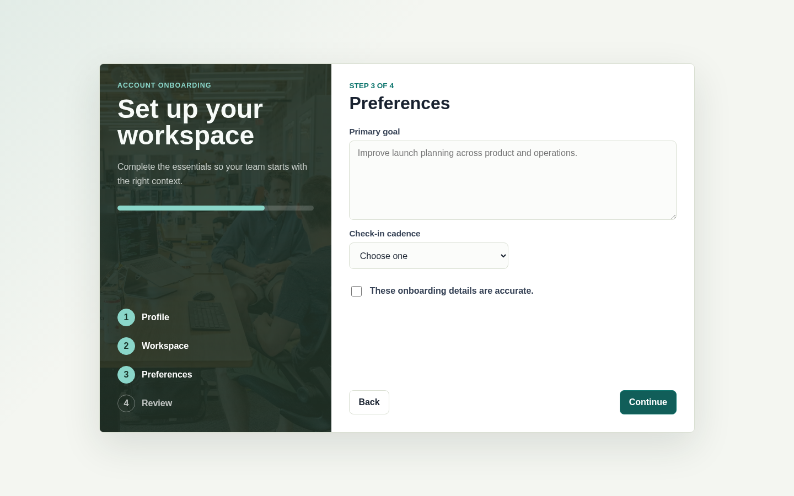
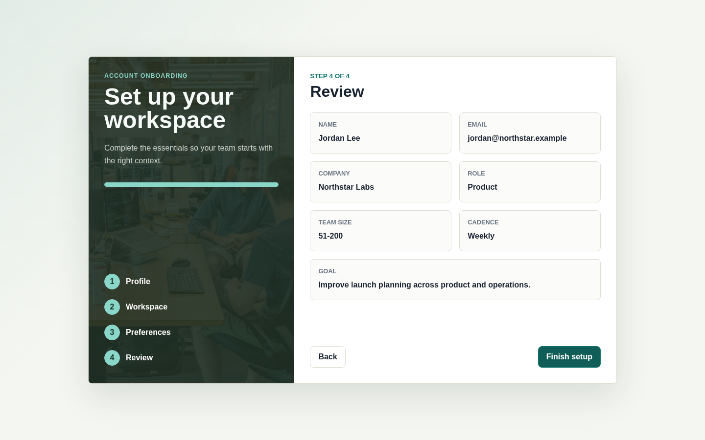
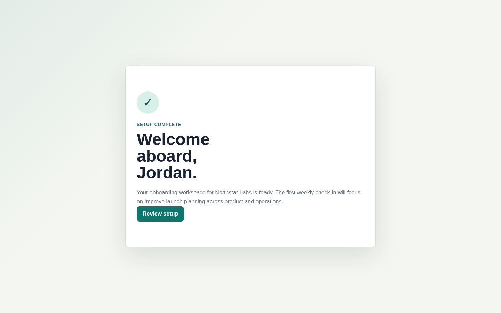

# Onboarding Flow

This page documents the multi-step onboarding form and the browser-verified states captured for review.

The screenshots use sample onboarding inputs for documentation only.

## Step 1: Profile

## Validation Error

Submitting the first step with empty required fields shows inline validation.

## Step 2: Workspace

## Step 3: Preferences

## Step 4: Review

## Success

